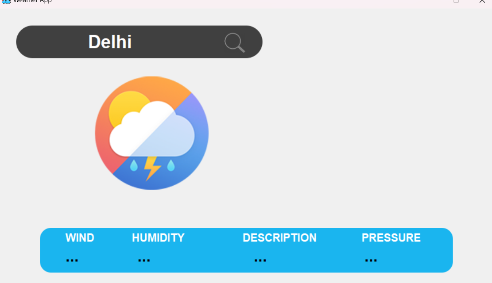
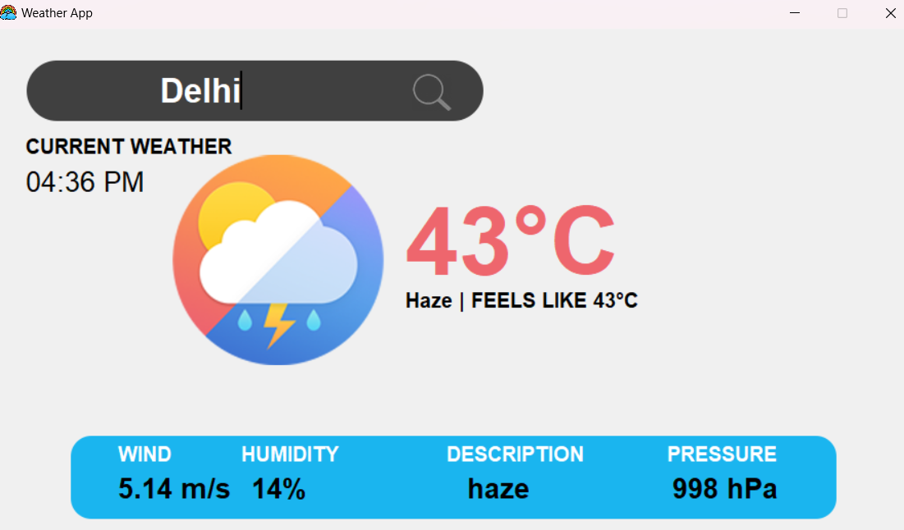

# Weather App

This is a simple weather application built using Python and Tkinter. It fetches current weather information for a specified city using the OpenWeatherMap API and displays it in a user-friendly graphical interface.

## Screenshots




## Features

- Displays current temperature, weather condition, wind speed, humidity, description, and pressure for a specified city.
- Shows local time of the specified city.
- User-friendly interface with a search box and search button.

## Installation

1. Clone the repository:
    ```bash
    git clone https://github.com/Coder-786hub/weather-app.git
    ```

2. Change into the project directory:
    ```bash
    cd weather-app
    ```

3. Install the required Python packages:
    ```bash
    pip install -r requirements.txt
    ```

4. Replace `'YOUR_API_KEY'` in the code with your actual OpenWeatherMap API key.

## Running the Application

1. Run the Python script:
    ```bash
    python weather_app.py
    ```

2. The application window will appear. Enter the name of a city in the search box and click the search icon to fetch the current weather information for that city.

## Files

- `weather_app.py`: The main Python script for the weather application.
- `requirements.txt`: List of required Python packages.
- `icon.ico`: Icon for the application window.

## License

This project is licensed under the MIT License. See the [LICENSE](LICENSE) file for details.

## Acknowledgements

- [OpenWeatherMap API](https://openweathermap.org/api) for providing weather data.
- [Geopy](https://github.com/geopy/geopy) for geocoding services.
- [TimezoneFinder](https://github.com/jannikmi/timezonefinder) for finding the timezone of a location.
- [Pytz](https://github.com/stub42/pytz) for handling timezone conversions.
